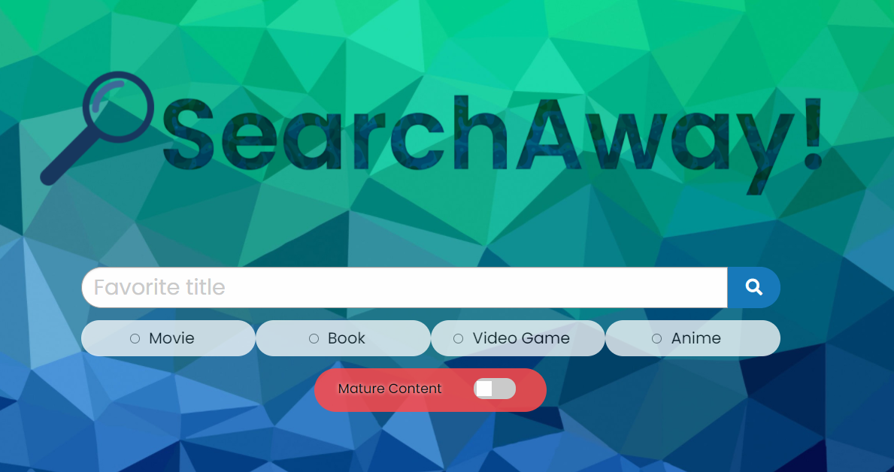
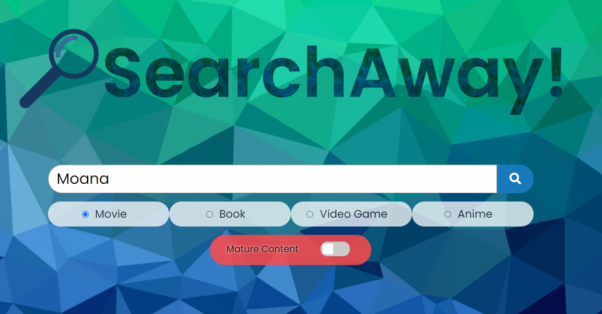
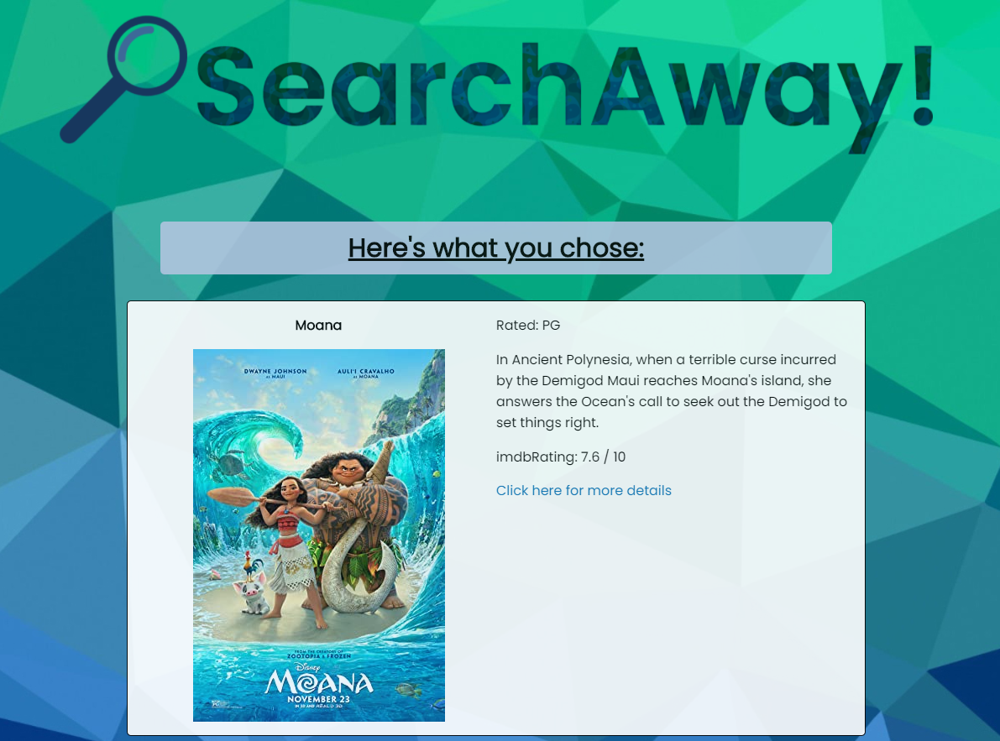
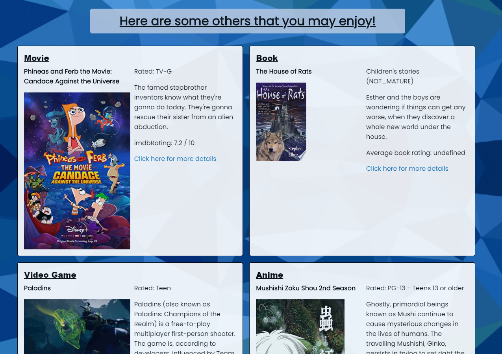
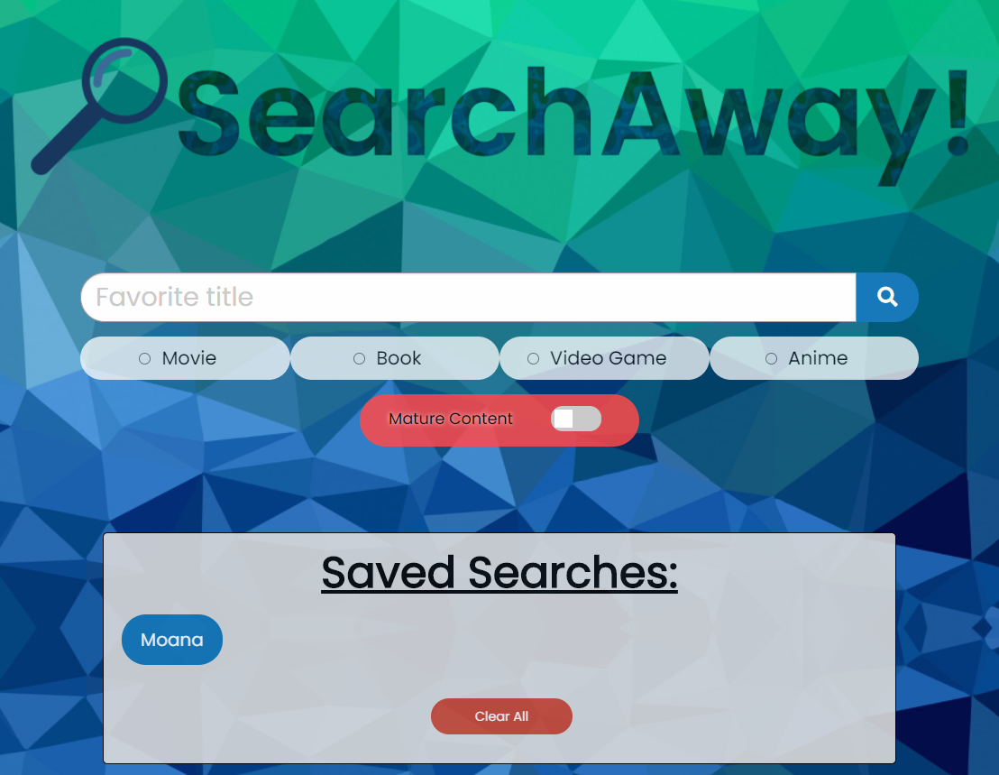

# SearchAway 🎥📖🎮🖼️

***

 

## Description

SearchAway is a website that will take your favorite title of a movie, book, video game, or anime, and provide you with recommendations that you may also enjoy!  The recommendations will include a movie, a book, a video game, and an anime!  If you like the results that had generated, you can save them to go back and look at later.  The results are currently generated based on the genres from your favorite title.

## Usage

On the home page, you will have a search bar to enter in your favorite title from one of the media choices provided.  After entering a title, you will then select which media the title is for (movie, book, video game, or anime), as well as an option to include mature content.

Clicking on Find Some Recommendations will bring up a results page!  The top section will show the title that you had chosen.  There will then be 4 boxes below with a recommendation title for each media type.  The information will include the media title, a poster image, the rating (based on media; e.g. movies will have the MPAA rating), a description of the plot, and the score (also based on the media; e.g. movies will have an IMDb rating).

To search another title, click on the "Go back to the search page!" button at the bottom of the results. To save the result of the titles produced, click on the "Save this result!" button.

Once you save the result, you will see a "Saved Searches" section with a button produced for your favorite title!  You will have the option to clear these search results as well.

#### Notes on Usage
🍿 The search is currently only searching by one genre taken from the favorite title.\
🍿 There are 5 APIs being used:\
&nbsp;&nbsp;&nbsp;&nbsp;&nbsp;&nbsp;✔️[The Open Movie Databse API](http://www.omdbapi.com/)\
&nbsp;&nbsp;&nbsp;&nbsp;&nbsp;&nbsp;✔️[The Movie Databse API](https://www.themoviedb.org/documentation/api)\
&nbsp;&nbsp;&nbsp;&nbsp;&nbsp;&nbsp;✔️[Google Books API](https://developers.google.com/books)\
&nbsp;&nbsp;&nbsp;&nbsp;&nbsp;&nbsp;✔️[RAWG Video Games Database API](https://rawg.io/apidocs)\
&nbsp;&nbsp;&nbsp;&nbsp;&nbsp;&nbsp;✔️[Jikan API](https://jikan.moe/)

## What We Learned
We are proud with the result of this site as it currently is.  We were able to combine multiple APIs in order to produce recommendations, and had learned a lot along the way.  We each were able to learn a new API, as well as how to explore it and make it work.  We also took what we had learned about the specific API we worked on and had summarized to each group member basic informatoin on how the API was working.\
We also learned the Foundation CSS framework and how to utilize it in styling our website.\
Becoming knowledgeable with the collaboration became a big part as well.  Learning how to utilize Git and GitHub to create/merge branches, creating pull requests, updating our kanban, and having scrum meetings helped us learn the organization aspect for projects!

## How we can improve it
We would want to improve the functionality to search for results by multiple parameters rather than just one genre.  Some of these would include:\
🍿 Multiple genres\
🍿 Using keywords from the title\
🍿 Using keywords from the plot\
🍿 Provide an option to search if the same title is available in the different medias\
We have also heard of Machine Learning, and would also want to explore this feature as well.\

## Contributors
[Brian Parker](https://github.com/btparker70)
[Christina Shiroma](https://github.com/Christina2021)
[Karly Maruyama](https://github.com/karlypaige)
[Sean Chang](https://github.com/highwolfx)

## License
[MIT](https://choosealicense.com/licenses/mit/#)